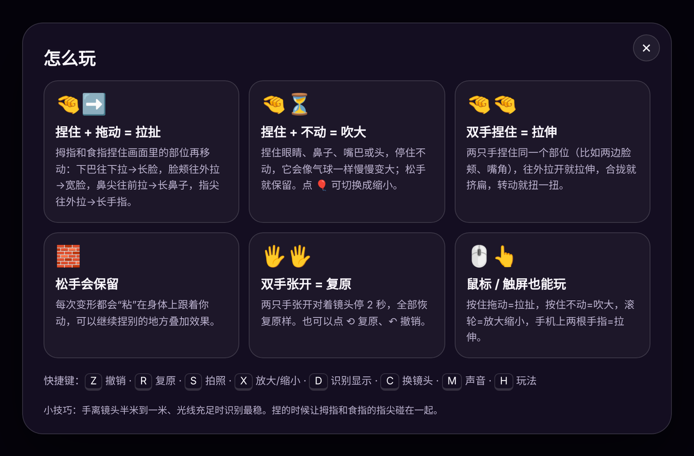
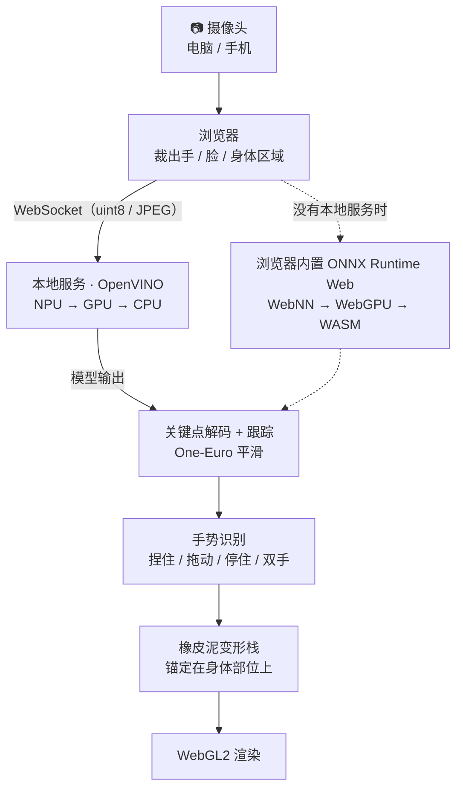
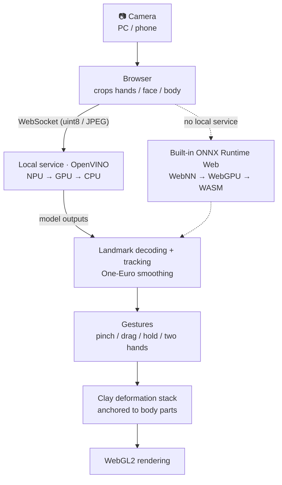

<div align="center">


# 橡皮泥魔镜 · ClayMirror

**用手指捏住镜头里的自己，像捏橡皮泥一样拉长、吹大、挤扁。**<br>
**Pinch yourself on camera and squish your face like modelling clay.**

[](#ai-zh)
[](#npu-zh)
[](https://github.com/openvinotoolkit/openvino)
[](https://www.python.org/)
[](LICENSE)

**简体中文** · [English](#english)

</div>

<a id="zh"></a>

## 简介

橡皮泥魔镜是一个实时相机互动小玩具。打开电脑或手机的摄像头，它会实时识别画面里的**人物、脸部（468 点网格）、双手（每只 21 个关键点）和身体姿态（33 个关键点）**。用拇指和食指"捏住"画面中的眼睛、鼻子、嘴巴、脸颊、下巴、手指、手臂或头，就能像捏橡皮泥一样把它**拉长、吹大、挤扁、扭一扭**。松手后形状会保留，并且粘在对应的身体部位上，跟着你移动、转头，可以一直叠加下去。

所有识别模型**优先在 Intel NPU**（Core Ultra 处理器里的 Intel AI Boost）上运行；某个模型在 NPU 上跑不了、或者 NPU 算力不够时，才自动改用 GPU / CPU；没有 NPU 的电脑直接用 GPU / CPU。

> [!NOTE]
> 本项目的全部代码、模型转换和文档均由 **Claude Opus 5.5**（Anthropic）生成，详见 [由 AI 生成](#ai-zh)。

<table>
  <tr>
    <th>开始界面</th>
    <th>玩法说明</th>
  </tr>
  <tr>
    <td></td>
    <td></td>
  </tr>
</table>

<!-- 想放演示动图：录一段 GIF 存成 docs/demo.gif，再把下一行取消注释 -->
<!-- <p align="center"></p> -->

## ✨ 功能特点

- 🎯 **实时识别**：人物检测、468 点脸部网格、双手 21 点关键点、33 点身体骨架（模型来自 Google MediaPipe，转换为 ONNX）
- 🤏 **三种手势**：捏住拖动 = 拉扯；捏住不动 = 吹大；双手捏住同一部位 = 拉伸 / 挤扁 / 扭转
- 🧱 **像橡皮泥一样保留**：每个变形都锚定在身体部位上，松手后跟着你动；可以叠加、撤销、一键复原
- ✋ **手在最前面**：正在捏的手不会被变形扭曲，看起来就像真的捏住了自己的脸
- ⚡ **NPU 优先**：OpenVINO 逐个模型先上 NPU，编译失败或负载超出预算才回退到 GPU / CPU，运行中持续监测
- 📱 **手机也能玩**：扫码用手机摄像头，画面通过局域网交给电脑的 NPU 计算
- 🖱️ 鼠标、触屏、键盘都支持；📸 一键拍照；🔊 合成音效
- 🔒 画面只在本机（或你自己的电脑）处理，不会上传

## 🚀 快速开始

### Windows（推荐）

1. 下载本仓库：GitHub 页面点 **Code → Download ZIP** 后解压，或者用 `git clone`。
2. 双击 **`start.bat`**：
   - 第一次运行会自动创建 `.venv` 虚拟环境并安装依赖（约 100 MB，只需一次）；电脑没有 Python 时，会尝试用 `winget` 安装 Python 3.12。
   - 第一次启动会把 6 个模型编译到 NPU（约 10–60 秒，页面上有进度），结果缓存在 `.ov_cache`，之后几秒就能启动。
3. 浏览器会自动打开 **http://localhost:8848**，点「📷 打开摄像头开始」。

> [!TIP]
> 左上角徽章显示 **⚡ Intel NPU** 就表示正在用 NPU。点它能看到每个模型跑在哪个设备、每次推理多少毫秒；也可以打开 *任务管理器 → 性能 → NPU* 看占用。

### Linux / macOS

```bash
./start.sh
```

Linux 装好 Intel NPU 驱动（linux-npu-driver）后也能用 NPU；macOS 上 OpenVINO 使用 CPU。

### 运行要求

| 项目 | 要求 |
|---|---|
| 系统 | Windows 10 / 11（推荐）、Linux、macOS |
| Python | 3.10 及以上（`start.bat` 会自动处理） |
| 浏览器 | 最新版 Edge / Chrome（需要 WebGL2） |
| NPU（可选） | Intel Core Ultra + Windows 11 + [Intel NPU 驱动](https://www.intel.com/content/www/us/en/download/794734/intel-npu-driver-windows.html) |

### 命令行参数

```bat
start.bat [--device auto|NPU|GPU|CPU] [--port 8848] [--local-only] [--no-browser]
```

| 参数 | 说明 |
|---|---|
| `--device` | 计算设备策略，默认 `auto`（NPU 优先，自动回退） |
| `--port` | HTTP 端口，默认 `8848`；给手机用的 HTTPS 端口 = 该端口 + 1 |
| `--local-only` | 只允许本机访问，不开放给局域网（手机将无法连接） |
| `--no-browser` | 启动后不自动打开浏览器 |

也可以用环境变量 `CLAY_DEVICE`、`CLAY_PORT` 设置。

## 🎮 玩法

| 手势 | 效果 |
|---|---|
| 🤏 拇指 + 食指捏住 → **拖动** | **拉扯**：下巴往下拉 = 长脸，脸颊往外拉 = 宽脸，鼻尖往前拉 = 长鼻子，指尖往外拉 = 长手指，手臂 / 头顶 = 夸张变形 |
| 🤏 捏住 → **停住不动**（约半秒后） | **吹大**：眼睛、鼻子、嘴巴、脸颊、头……像吹气球一样越来越大（工具栏 🎈 可切换成缩小） |
| 🤏🤏 **双手**捏住同一个部位 | 两边往外拉开 = 拉伸（比如两边脸颊、两个嘴角），合拢 = 挤扁，转动 = 扭一扭 |
| 松手 | 变形保留并粘在身体上跟着动，继续捏别的地方会叠加 |
| 🖐️🖐️ 双手张开停约 2 秒 | 全部复原 |
| 🖱️ 鼠标 / 👆 触屏 | 按住拖动 = 拉扯，按住不动 = 吹大，滚轮 = 放大 / 缩小，手机上两根手指 = 拉伸 |
| ⌨️ 键盘 | `Z` 撤销 · `R` 复原 · `S` 拍照 · `X` 放大/缩小 · `D` 显示识别骨架 · `C` 换镜头 · `M` 声音 · `H` 玩法 |

小技巧：离镜头半米到一米、光线充足时最稳；捏的时候让拇指和食指的指尖真正碰在一起。

## 📱 用手机摄像头玩

1. 电脑运行 `start.bat`，手机和电脑连同一个 Wi-Fi。
2. 网页右上角点 **📱 手机**，用手机扫二维码（地址形如 `https://192.168.x.x:8849`）。
3. 手机提示"连接不是私密连接"时，点 **高级 → 继续前往**。这是程序第一次运行时自动生成的本机自签名证书：浏览器只允许 https 页面使用摄像头。
4. 手机拍到的画面会通过局域网交给**电脑的 NPU** 计算。第一次运行如果 Windows 防火墙弹窗，请允许 Python 访问"专用网络"。

<a id="npu-zh"></a>

## ⚡ NPU 是怎么用上的

本地服务（`server/npu_engine.py`）使用 **OpenVINO**，按下面的规则给每个模型分配设备：

1. 每个模型**先在 NPU 上编译**，编译结果缓存在 `.ov_cache`。
2. 某个模型在 NPU 上编译失败 → 自动换 **GPU**，还不行就换 **CPU**。
3. 启动时给每个模型测速；如果 NPU 每帧要做的工作超过时间预算（约 24 ms），就把最重的模型挪到 GPU / CPU，直到跑得动为止。
4. 运行中持续监测，NPU 长时间过载（超过预算的 1.5 倍）会自动重新分配。
5. 图像归一化也编进了模型（OpenVINO PrePostProcessor），直接在 NPU 上完成；浏览器只发送 uint8 裁剪图。

在 ⚡ 面板里可以改成"只用 NPU / GPU / CPU"。没有运行本地服务时，网页会改用**浏览器内置引擎**（ONNX Runtime Web），依次尝试 WebNN (NPU) → WebGPU (GPU) → WASM (CPU)。

检查 NPU 是否可用（列出 OpenVINO 看到的设备，并在 NPU / GPU / CPU 上分别编译、测速每个模型）：

```bat
.venv\Scripts\python tools\check_npu.py
```

## 🧠 技术原理



- **识别管线**（`web/js/vision.js`）：和 MediaPipe 一样采用"检测 + 跟踪"——检测器只在还没跟踪到目标时运行，之后每帧用上一帧的关键点推算下一帧的区域；一帧里的所有模型打包成一次请求、并行推理；关键点用 One-Euro 滤波去抖。
- **变形**（`web/js/clay.js`）：三种基本变形——拉扯（沿拖动路径分成小步依次复合，像拉太妃糖）、吹大（局部放大）、双手拉伸（带渐变边缘的缩放 / 旋转 / 平移）。每个变形都锚定在脸部网格顶点、手指骨骼或身体骨骼上，参数存在该部位的局部坐标系里，所以会跟着人移动、旋转、远近缩放；多个变形按先后顺序复合，同一个地方可以越拉越长。
- **渲染**（`web/js/renderer.js`）：WebGL2 先在半分辨率网格上算出位移场，再采样摄像头画面；手部区域只受它自己的变形影响，所以捏东西的手总是清晰地"盖"在最前面。
- **模型**：Google MediaPipe 的手掌检测 / 手部关键点、人脸检测 / 脸部网格、人体检测 / 身体姿态（Apache-2.0），转换成 ONNX（见 `tools/convert_models.py`），服务端和浏览器共用同一套模型。

## 📁 项目结构

```
ClayMirror/
├─ start.bat / start.sh      一键启动
├─ requirements.txt          Python 依赖
├─ server/
│  ├─ server.py              网页 + WebSocket 推理服务（http 8848 / https 8849）
│  └─ npu_engine.py          OpenVINO：NPU 优先、GPU/CPU 回退、测速与负载均衡
├─ web/
│  ├─ index.html, style.css  界面
│  ├─ js/                    识别管线、橡皮泥变形、手势交互、WebGL 渲染、音效
│  ├─ models/                ONNX 模型（服务端与浏览器共用）
│  └─ vendor/                ONNX Runtime Web、qrcode-generator
├─ tools/                    check_npu.py（NPU 自检）、模型转换脚本
└─ docs/                     README 用的图片
```

运行后自动生成、不需要提交的内容已写进 `.gitignore`：`.venv/`、`.ov_cache/`、`server/certs/`（本机 HTTPS 证书和私钥）。

## ❓ 常见问题

- **摄像头打不开**：点地址栏左边的 🔒 / 📷 图标允许使用摄像头；关掉正在占用摄像头的会议软件。
- **徽章显示 GPU / CPU 而不是 NPU**：运行 `tools\check_npu.py` 看 NPU 有没有被识别，更新 Intel NPU 驱动后重启 `start.bat`。也可能是 NPU 每帧负载超出预算，部分模型被自动挪到了 GPU / CPU（⚡ 面板里会写原因）。
- **直接双击 `index.html` 打不开**：浏览器不允许本地文件加载模块和模型，请用 `start.bat` 启动。
- **提示端口被占用**：已经有一个 ClayMirror 在运行；或者换个端口：`start.bat --port 8850`。
- **想重新安装依赖**：删掉 `.venv` 文件夹，再双击 `start.bat`。

## 🚧 已知限制

- 只跟踪一个人（一张脸、一个身体、两只手）。
- 变形是 2D 图像变形；捏着的时候，被手挡住的地方会被拉出一点拖影。
- 手机模式第一次需要手动信任自签名证书。
- 浏览器的 WebNN 目前还是实验功能，所以 NPU 加速主要靠本地的 OpenVINO 服务。
- 界面目前只有简体中文。

<a id="ai-zh"></a>

## 🤖 由 AI 生成

本项目由 Anthropic 的 **Claude Opus 5.5** 生成，包括全部前端与后端代码、模型转换与验证脚本、界面设计、图标和这份 README。

- **创意与需求**：ZJY
- **生成时做过的测试**：在云端沙盒里用 OpenVINO（CPU）+ Chromium（模拟摄像头和模拟手势）做了端到端测试；手部和脸部关键点与 MediaPipe 官方结果相差约 1–3 像素；NPU 优先 / 回退的分配逻辑用模拟的 NPU 测试过。
- 欢迎在 Issues 里反馈你在 Intel NPU 真机上的运行情况。

## 🙏 致谢

- [Google MediaPipe](https://github.com/google-ai-edge/mediapipe)：手部 / 脸部 / 身体模型（Apache-2.0）
- [Intel OpenVINO](https://github.com/openvinotoolkit/openvino)：NPU / GPU / CPU 推理
- [ONNX Runtime Web](https://github.com/microsoft/onnxruntime)：浏览器内置引擎（MIT）
- [qrcode-generator](https://github.com/kazuhikoarase/qrcode-generator)：二维码（MIT）

## 📄 许可证

代码采用 [MIT 许可证](LICENSE)。模型和第三方库各自的许可见 [THIRD_PARTY_NOTICES.md](THIRD_PARTY_NOTICES.md)。

---

<a id="english"></a>

<div align="center">

# English

[简体中文](#zh) · **English**

</div>

## About

ClayMirror is a real-time camera toy. Turn on your computer's or phone's camera and it tracks **people, faces (a 468-point mesh), both hands (21 keypoints each) and body pose (33 keypoints)** live. Pinch an eye, your nose, mouth, a cheek, your chin, a finger, an arm or the top of your head between your thumb and index finger, and you can **stretch, inflate, squash and twist** it like modelling clay. When you let go, the shape stays — glued to that body part, following you as you move and turn your head — so you can keep stacking effects.

All vision models run on the **Intel NPU first** (Intel AI Boost in Core Ultra processors). A model only moves to the GPU or CPU when it can't run on the NPU or the NPU can't keep up; machines without an NPU simply use the GPU / CPU.

> [!NOTE]
> All code, model conversion and documentation in this project were generated by **Claude Opus 5.5** (Anthropic). See [Generated by AI](#ai-en).

<table>
  <tr>
    <th>Start screen</th>
    <th>Gesture guide</th>
  </tr>
  <tr>
    <td></td>
    <td></td>
  </tr>
</table>

The interface is currently in Simplified Chinese.

## ✨ Features

- 🎯 **Real-time tracking**: person detection, 468-point face mesh, 21-point hands, 33-point body skeleton (Google MediaPipe models converted to ONNX)
- 🤏 **Three gestures**: pinch + drag = pull; pinch + hold = inflate; pinch the same part with both hands = stretch / squash / twist
- 🧱 **Clay that stays**: every deformation is anchored to a body part and keeps following you after you let go; stack them, undo, or reset
- ✋ **Hands stay on top**: the hand doing the pinching is never distorted, so it looks like you are really holding your own face
- ⚡ **NPU first**: OpenVINO puts each model on the NPU first and falls back to GPU / CPU only if compilation fails or the NPU exceeds its per-frame budget; the load is monitored while running
- 📱 **Phone camera**: scan a QR code to use your phone's camera; frames go over your local network to your PC's NPU
- 🖱️ Mouse, touch and keyboard controls; 📸 one-click snapshots; 🔊 synthesized sound effects
- 🔒 Video is processed only on your own machine — nothing is uploaded

## 🚀 Quick start

### Windows (recommended)

1. Download this repository: **Code → Download ZIP** and unzip it, or `git clone` it.
2. Double-click **`start.bat`**:
   - On the first run it creates a `.venv` virtual environment and installs the dependencies (about 100 MB, once). If Python is missing, it tries to install Python 3.12 with `winget`.
   - The first start compiles the 6 models for the NPU (about 10–60 s, with progress shown on the page). The result is cached in `.ov_cache`, so later starts take a few seconds.
3. Your browser opens **http://localhost:8848**. Click **「📷 打开摄像头开始」** (*Start camera*).

> [!TIP]
> The badge in the top-left corner shows **⚡ Intel NPU** when the NPU is in use. Click it to see which device each model runs on and how many milliseconds each inference takes. You can also watch *Task Manager → Performance → NPU*.

### Linux / macOS

```bash
./start.sh
```

On Linux the NPU works once Intel's NPU driver (linux-npu-driver) is installed; on macOS OpenVINO runs on the CPU.

### Requirements

| Item | Requirement |
|---|---|
| OS | Windows 10 / 11 (recommended), Linux, macOS |
| Python | 3.10 or newer (`start.bat` takes care of it) |
| Browser | Latest Edge / Chrome (WebGL2 required) |
| NPU (optional) | Intel Core Ultra + Windows 11 + [Intel NPU driver](https://www.intel.com/content/www/us/en/download/794734/intel-npu-driver-windows.html) |

### Command-line options

```bat
start.bat [--device auto|NPU|GPU|CPU] [--port 8848] [--local-only] [--no-browser]
```

| Option | Meaning |
|---|---|
| `--device` | Device policy; default `auto` (NPU first, automatic fallback) |
| `--port` | HTTP port, default `8848`; the HTTPS port for phones is this port + 1 |
| `--local-only` | Only accept connections from this computer (phones cannot connect) |
| `--no-browser` | Do not open the browser automatically |

The environment variables `CLAY_DEVICE` and `CLAY_PORT` work too.

## 🎮 How to play

| Gesture | Effect |
|---|---|
| 🤏 Pinch with thumb + index finger → **drag** | **Pull**: drag the chin down for a long face, pull a cheek outward for a wide face, pull the tip of the nose for a long nose, pull a fingertip for a long finger, pull an arm or the top of the head for wild shapes |
| 🤏 Pinch → **hold still** (after about half a second) | **Inflate**: eyes, nose, mouth, cheeks, the whole head… grow like a balloon (the 🎈 button switches to shrinking) |
| 🤏🤏 Pinch the same part with **both hands** | Pull apart = stretch (e.g. both cheeks, both corners of the mouth), push together = squash, rotate = twist |
| Let go | The shape stays and follows that body part; pinch somewhere else to stack effects |
| 🖐️🖐️ Hold both palms open for about 2 s | Reset everything |
| 🖱️ Mouse / 👆 touch | Press + drag = pull, press + hold = inflate, mouse wheel = grow / shrink, two fingers on a phone = stretch |
| ⌨️ Keyboard | `Z` undo · `R` reset · `S` snapshot · `X` grow/shrink · `D` show tracking skeleton · `C` switch camera · `M` sound · `H` help |

Tips: tracking is most stable 0.5–1 m from the camera in good light. When pinching, make the tips of your thumb and index finger actually touch.

## 📱 Use your phone's camera

1. Run `start.bat` on the PC and connect the phone to the same Wi-Fi.
2. Click **📱 手机** (*Phone*) in the top-right corner of the page and scan the QR code with your phone (the address looks like `https://192.168.x.x:8849`).
3. When the phone warns that the connection is not private, tap **Advanced → Proceed**. The certificate is a self-signed one generated on your PC the first time it runs; browsers only allow camera access on https pages.
4. The phone's frames are sent over your local network to **your PC's NPU**. If Windows Firewall asks on the first run, allow Python on private networks.

<a id="npu-en"></a>

## ⚡ How the NPU is used

The local service (`server/npu_engine.py`) uses **OpenVINO** and assigns a device to every model with these rules:

1. Every model is **compiled for the NPU first**; compiled models are cached in `.ov_cache`.
2. If a model fails to compile on the NPU, it moves to the **GPU**, and then to the **CPU**.
3. Every model is benchmarked at startup. If the NPU's per-frame work exceeds the time budget (about 24 ms), the heaviest model is moved to the GPU / CPU until everything fits.
4. The load keeps being monitored while running; if the NPU stays overloaded (over 1.5× the budget), models are reassigned automatically.
5. Image normalization is compiled into the models (OpenVINO PrePostProcessor) and runs on the NPU too; the browser only sends uint8 crops.

You can force "NPU only / GPU only / CPU only" in the ⚡ panel. Without the local service, the page falls back to a **built-in browser engine** (ONNX Runtime Web) that tries WebNN (NPU) → WebGPU (GPU) → WASM (CPU).

To check the NPU (lists the devices OpenVINO sees, then compiles and benchmarks every model on NPU / GPU / CPU):

```bat
.venv\Scripts\python tools\check_npu.py
```

## 🧠 How it works



- **Vision pipeline** (`web/js/vision.js`): detect-then-track like MediaPipe. Detectors only run while something is not tracked yet; after that, each frame's region of interest comes from the previous frame's landmarks. All models for a frame are batched into one request and run in parallel, and landmarks are smoothed with a One-Euro filter.
- **Deformations** (`web/js/clay.js`): three primitives — pull (the drag path is split into small steps that compose like stretched taffy), inflate (a local magnification) and two-hand stretch (scale / rotate / translate with a soft edge). Each one is anchored to a face-mesh vertex, a finger bone or a body bone and stores its parameters in that part's local frame, so it follows you as you move, turn and come closer. Deformations compose in order, so you can keep pulling the same spot further.
- **Rendering** (`web/js/renderer.js`): WebGL2 first computes a displacement field on a half-resolution grid, then samples the camera frame. Inside a hand only that hand's own deformations apply, so the pinching hand always stays sharp and in front.
- **Models**: Google MediaPipe palm detection / hand landmarks, face detection / face mesh and pose detection / pose landmarks (Apache-2.0), converted to ONNX (see `tools/convert_models.py`). The service and the browser share the same model files.

## 📁 Project layout

```
ClayMirror/
├─ start.bat / start.sh      one-click launchers
├─ requirements.txt          Python dependencies
├─ server/
│  ├─ server.py              web app + WebSocket inference service (http 8848 / https 8849)
│  └─ npu_engine.py          OpenVINO: NPU first, GPU/CPU fallback, benchmarking, load balancing
├─ web/
│  ├─ index.html, style.css  user interface
│  ├─ js/                    vision pipeline, clay deformations, gestures, WebGL rendering, sound
│  ├─ models/                ONNX models (shared by the service and the browser)
│  └─ vendor/                ONNX Runtime Web, qrcode-generator
├─ tools/                    check_npu.py (NPU self-check), model conversion scripts
└─ docs/                     images for this README
```

Files created at runtime are listed in `.gitignore` and should not be committed: `.venv/`, `.ov_cache/`, `server/certs/` (the local HTTPS certificate and its private key).

## ❓ FAQ

- **The camera does not start**: click the 🔒 / 📷 icon on the left of the address bar and allow the camera; close any meeting app that is using it.
- **The badge shows GPU / CPU instead of NPU**: run `tools\check_npu.py` to see whether the NPU is detected, update the Intel NPU driver and restart `start.bat`. It can also mean the NPU exceeded its per-frame budget and some models were moved to the GPU / CPU (the ⚡ panel explains why).
- **Double-clicking `index.html` does not work**: browsers do not let local files load modules and models; start it with `start.bat`.
- **"Port in use"**: ClayMirror is already running, or pick another port: `start.bat --port 8850`.
- **Reinstall the dependencies**: delete the `.venv` folder and double-click `start.bat` again.

## 🚧 Known limitations

- Tracks one person (one face, one body, two hands).
- Deformations are 2D image warps; while you pinch, the area hidden behind your hand can smear a little.
- Phone mode needs you to trust the self-signed certificate once.
- WebNN in browsers is still experimental, so NPU acceleration relies on the local OpenVINO service.
- The interface is currently Simplified Chinese only.

<a id="ai-en"></a>

## 🤖 Generated by AI

This project was generated by **Claude Opus 5.5** from Anthropic — all frontend and backend code, the model conversion and validation scripts, the UI design, the logo and this README.

- **Idea and requirements**: ZJY
- **Testing during generation**: end-to-end in a cloud sandbox with OpenVINO (CPU) and Chromium (simulated camera and simulated hand gestures); hand and face landmarks are within about 1–3 px of MediaPipe's reference output; the NPU-first / fallback logic was tested with a simulated NPU.
- Reports from real Intel NPU hardware are very welcome — please open an issue.

## 🙏 Credits

- [Google MediaPipe](https://github.com/google-ai-edge/mediapipe): hand / face / pose models (Apache-2.0)
- [Intel OpenVINO](https://github.com/openvinotoolkit/openvino): NPU / GPU / CPU inference
- [ONNX Runtime Web](https://github.com/microsoft/onnxruntime): built-in browser engine (MIT)
- [qrcode-generator](https://github.com/kazuhikoarase/qrcode-generator): QR codes (MIT)

## 📄 License

The code is released under the [MIT License](LICENSE). Models and third-party libraries keep their own licenses — see [THIRD_PARTY_NOTICES.md](THIRD_PARTY_NOTICES.md).
